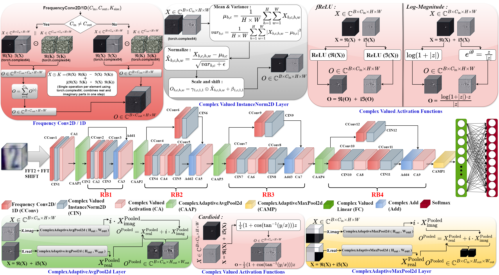

Frequency Domain Complex-Valued Convolutional Neural Network
===========
This repository contains code which reproduces experiments presented in the paper [Frequency Domain Complex-Valued Convolutional Neural Network](https://www.sciencedirect.com/science/article/pii/S0957417425025102).
<p align="center">
	
	<br>
	<em>The block diagram of the Complex-Valued Residual Convolutional Neural Network.</em>
</p>


## Requirements

The main requirements are listed below:

* Tested with NVIDIA RTX A5000 GPU with 24GB of memory
* Tested with CUDA 12.1 and CuDNN 9.8.2
* Python 3.10.13
* Ubuntu 20.04.3
* PyTorch 2.3.1+cu121
* torchvision 0.18.1
* matplotlib 3.8.3
* Numpy

## Datasets

* [DIAT-μRadHAR: Radar micro-Doppler Signature dataset for Human Suspicious Activity Recognition](https://ieee-dataport.org/documents/diat-mradhar-radar-micro-doppler-signature-dataset-human-suspicious-activity-recognition)
* [DIAT-µSAT: micro-Doppler Signature Dataset of Small Unmanned Aerial Vehicle (SUAV)](https://ieee-dataport.org/documents/diat-msat-micro-doppler-signature-dataset-small-unmanned-aerial-vehicle-suav)
* [PTB Diagnostic ECG dataset](https://www.physionet.org/content/ptbdb/1.0.0/)
* [MIT-BIH Arrhythmia dataset](https://www.physionet.org/content/mitdb/1.0.0/)
* [The Street View House Numbers (SVHN) Dataset](http://ufldl.stanford.edu/housenumbers/)
* [MNIST Dataset](http://yann.lecun.com/exdb/mnist/)

## Steps for training and testing
To train and test the frequency domain complex-valued convolutional neural network, run the following commands:

* python HAR.py
* python SUAV.py
* python PTB.py
* python MIT_BIH.py
* python SVHN.py
* python MNIST.py


If you find our work useful, you can cite our paper using:
```
@article{chakraborty2026frequency,
  title={Frequency domain complex-valued convolutional neural network},
  author={Chakraborty, Mainak and Aryapoor, Masood and Daneshtalab, Masoud},
  journal={Expert Systems with Applications},
  volume={295},
  pages={128893},
  year={2026},
  publisher={Elsevier}
}
```        
